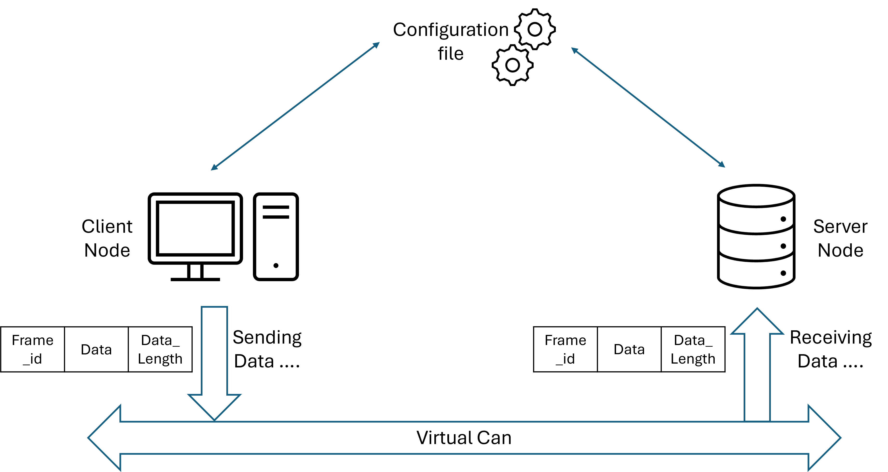
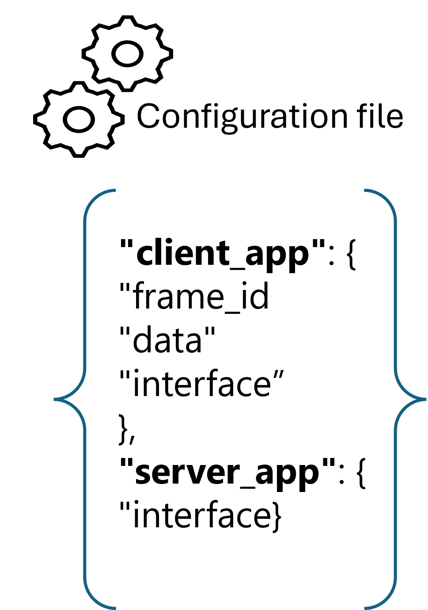

# Client Server Communication Using CAN

## Overview
This repository demonstrates a straightforward implementation of client-server communication utilizing the CAN protocol, developed in Rust. 
The client transmits a data frame associated with a specific frame ID through an interface specified in a configuration.json file.

## Application Architecture


## Tech Stack
Those technologies were used :
- Rust Programming Language
- Wireshark for the vizualization of the traffic
- shell scripting

## Project Structure

* Src Directory :
    - client.rs: Implementation of the client side to handle creation of the frame and sending it to the server.
    - server.rs: Implementation of the server side to create a virtual CAN interface and receiving the data from the client.
    - config.rs: Implementation of the configuration structure and load_config function.

* Config Directory :

    Contains the default configuration and other configurations using json files.

* Cargo.Toml :

    Contains the project configuration including the dependencies, the binaries, etc...

* test_client.sh and test_server.sh :
    Scripts used in run stage in the pipeline

* VirCanCreation.sh:
    Script use to create a virtual CAN interface
    usage : 

    - ```cd Project```
    
    - ```./VirCanCreation.sh interface_name```

* launch_communication.sh:
    Utility: Allows to run an application within a given or a default path.
    Usage: 
        ```./launch_communication.sh application path_to_configuration_file```
    Example:
        ```./launch_communication.sh client ./src/config/config.json```

## Configuration File Structure
{:width="300" height="200"}
The configuration is represented in JSON format and consists of two main components: client_app and server_app.
    * client_app
    The client_app section contains the following fields:
        - frame_id:
            Type: Integer
            Description: The identifier for the CAN frame. 
        - data:
            Type: Array of Integers
            Description: An array representing the data payload of the CAN frame.
        - interface:
            Type: String
            Description: The name of the virtual CAN interface used for communication.
    * server_app
    The server_app section contains the following field:        
        - interface:
            Type: String
            Description: The name of the virtual CAN interface that the server listens on. 


## Installation Instructions

### Prerequisites
    - Linux environment 
    - Ensure Cargo installation: 
        ```curl https://sh.rustup.rs -sSf | sh```

### Cloning the repository.
    clone the project via : 
        ```git clone https://gitlab.com/Aymen-Besbes/client_server_over_can.git```

## Usage:
1. clone the project via : git clone https://gitlab.com/Aymen-Besbes/client_server_over_can.git
2. Run ```cargo build```
3. Launch both applications on two different terminals:
    - Terminal1: ```./launch_communication.sh server path/to/config/file```
    - Terminal2: ```./launch_communication.sh client path/to/config/file```
    Note: Ensure running the server first and enter your root password to ensure the creation of the virtual can interface given at the configuration file.
